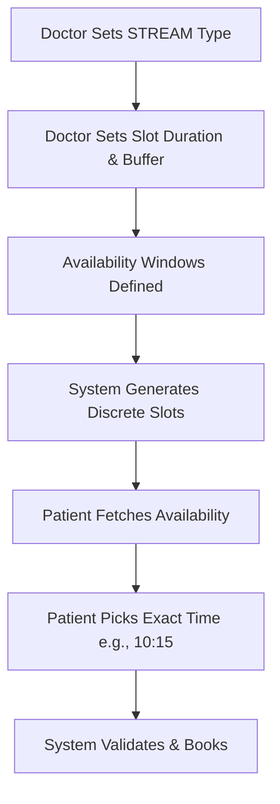
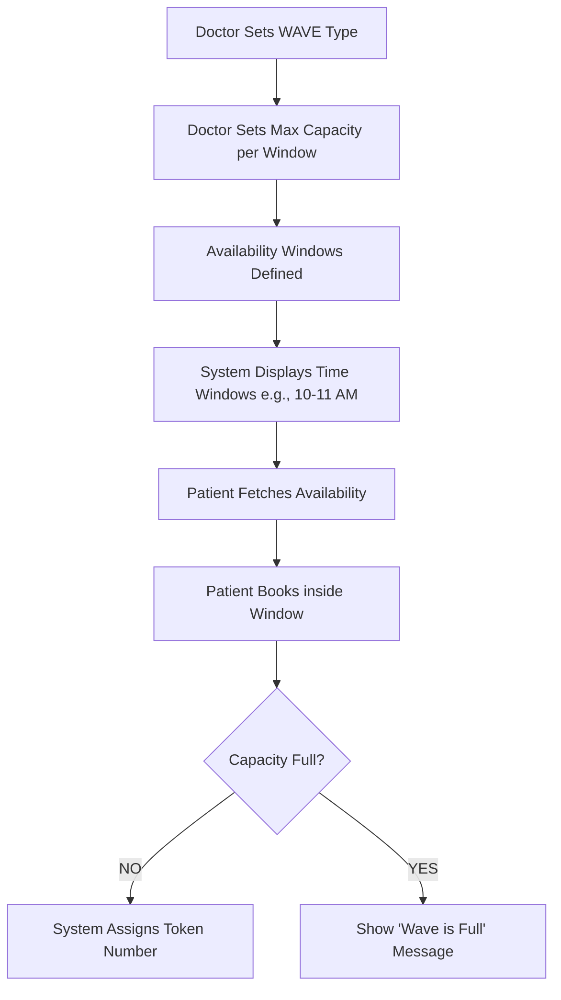

# Advanced Scheduling System (Stream & Wave)

## Stream Scheduling Flow (Exact Time)

## Wave Scheduling Flow (Token-Based)

## Business Rules Summary
| Feature | Stream Scheduling | Wave Scheduling |
| :--- | :--- | :--- |
| **Logic** | Fixed-length slots with buffers | Shared time windows |
| **Assignment** | Exact Start/End Time | Token Number in Window |
| **Capacity** | 1 Patient per slot | Max N Patients per window |
| **Best For** | Specialists, Dermatologists | General Physicians, OPD |
